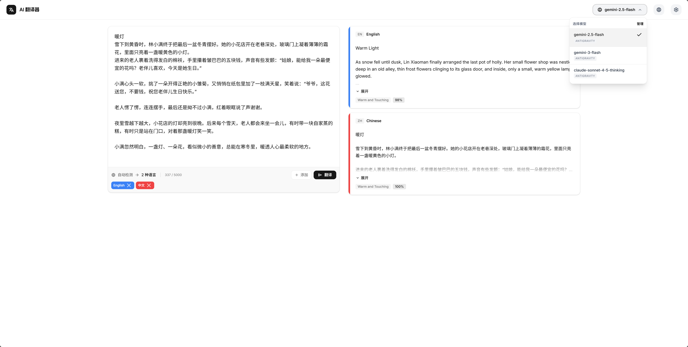
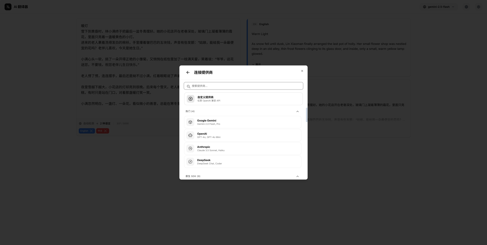
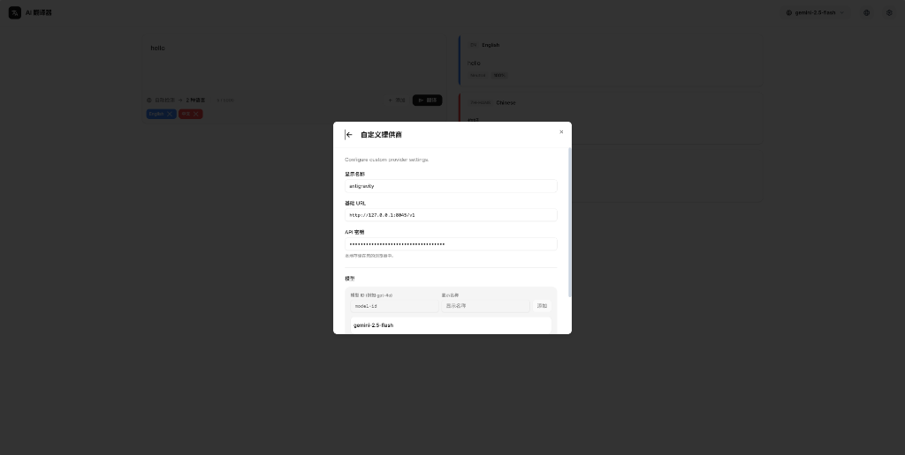

# AI Translator Dashboard

<div align="center">
  
</div>

<p align="center">
  <em>A collaborative creation, fully developed by <b>AI Agents</b>.</em><br/>
  <em>Co-developed by <b>Google Stitch</b>, <b>Google AI Studio</b>, and <b>Antigravity</b>.</em>
</p>

<p align="center">
  <a href="./README.zh.md">简体中文</a> | <b>English</b>
</p>

A modern AI-powered translation dashboard built with React 19, TypeScript, and the Vercel AI SDK. This project integrates multiple AI providers (Google Gemini, OpenAI, etc.) to deliver high-quality translations in a sleek, responsive interface.

<p align="center">
  <a href="https://zumma488.github.io/prism-translate/"><b>Live Demo</b></a>
</p>

## ✨ Features

- **Multi-Model Support**: Seamlessly switch between Google Gemini, OpenAI, and other providers via Vercel AI SDK.
- **Modern UI/UX**: Built with `shadcn/ui` and Tailwind CSS v4 for a premium, responsive design.
- **Micro-Animations**: Enhanced user experience with `tw-animate-css`.
- **Serverless Ready**: Optimized for deployment on Vercel Serverless Functions.
- **Type-Safe**: Full TypeScript support for robust development.

## 📸 Screenshots

### Dashboard



### Mobile & Responsive

<p align="center">
  
</p>

### Model Management

|                  Connection                  |              Custom Provider               |             Model Selection              |
| :------------------------------------------: | :----------------------------------------: | :--------------------------------------: |
|  |  |  |

## 🛠 Tech Stack

- **Framework**: React 19 + TypeScript + Vite
- **Styling**: Tailwind CSS v4
- **Components**: shadcn/ui
- **AI Integration**: Vercel AI SDK + Google Gemini + OpenAI
- **Deployment**: Vercel

## 🚀 Getting Started

### Prerequisites

- Node.js (v18 or higher)
- npm or pnpm

### Installation

1. Clone the repository:

   ```bash
   git clone https://github.com/zumma488/prism-translate.git
   cd prism-translate
   ```

2. Install dependencies:

   ```bash
   npm install
   ```

3. Configure environment variables (Optional):
   Copy `.env.example` to `.env.local` if you plan to use cloud providers (Google Gemini, OpenAI, etc.).

   ```bash
   cp .env.example .env.local
   ```

   Add your keys:

   ```env
   GEMINI_API_KEY=your_api_key_here
   # Add other provider keys as needed
   ```

   > **Note**: For local models (like Ollama), API keys are not required.

4. Run the development server:
   ```bash
   npm run dev
   ```

## 🤝 Contributing

Contributions are welcome! Please read our [Contributing Guide](CONTRIBUTING.md) and [Code of Conduct](CODE_OF_CONDUCT.md) for details.

## 📄 License

This project is licensed under the MIT License - see the [LICENSE](LICENSE) file for details.

## 👥 Author

**zumma488**

- GitHub: [@zumma488](https://github.com/zumma488)
