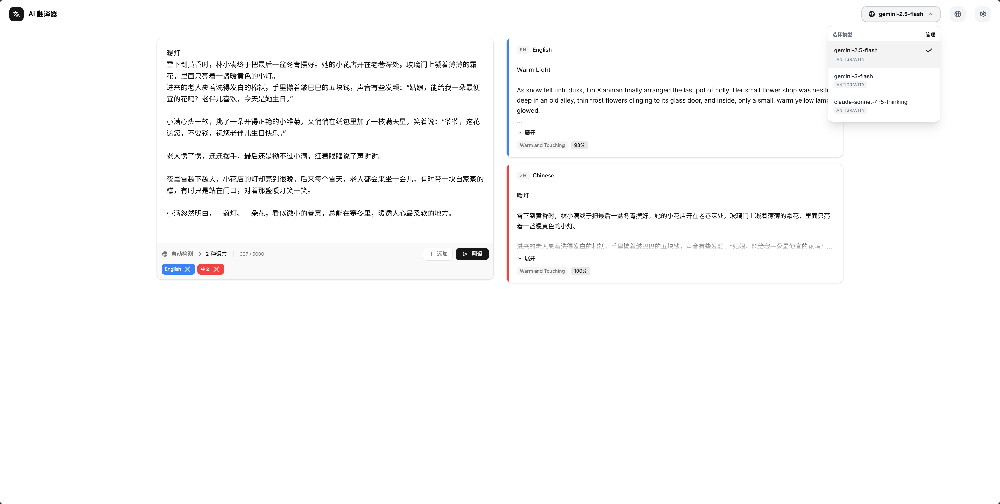
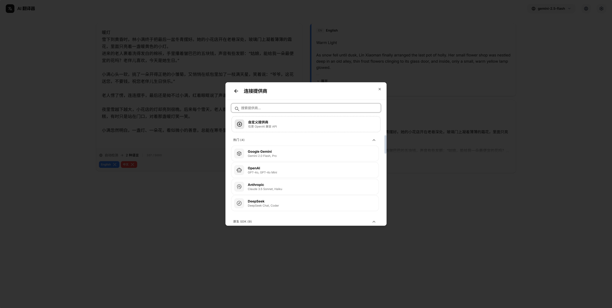
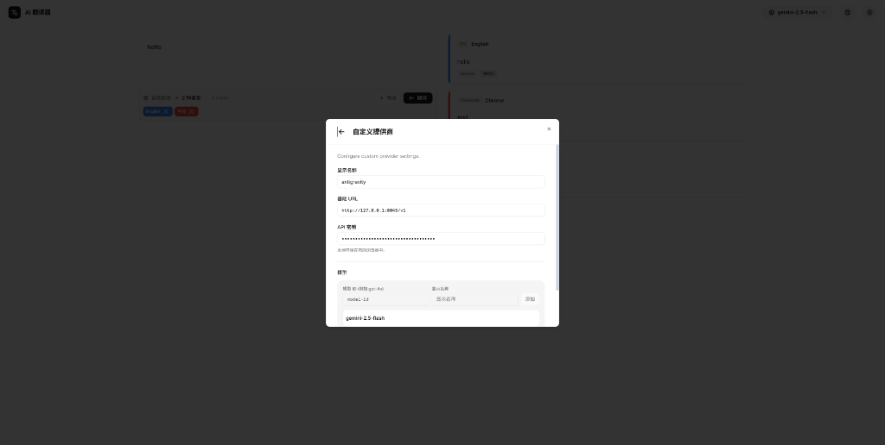
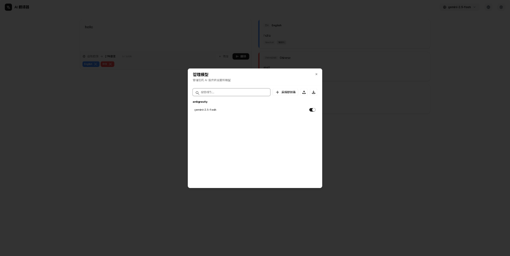

# Prism Translate

<p align="center">
  <a href="./README.zh.md">简体中文</a> | <b>English</b>
</p>

Prism Translate is a multi-language, multi-model, multi-provider translation comparison workspace. One input can be translated by multiple models, target languages can bind to different model sets, and results are presented for side-by-side quality comparison.

<p align="center">
  <a href="https://prism-translate.vercel.app/"><b>Live Demo</b></a>
</p>

## Features

- Compare multiple model outputs for the same source text.
- Bind different model sets to different target languages.
- Configure hosted providers and OpenAI-compatible endpoints.
- Manage provider settings, model lists, defaults, import/export, and persistence from the UI.
- Run translation through Next.js API handlers with server-side provider/model orchestration.
- Use a responsive UI with built-in i18n support.

## Current Architecture

The current codebase is a hybrid of active runtime structure and ongoing documentation-first refactor work.

- `app/`
  - Next.js App Router entrypoints.
  - Owns route files, layout, global styles, and API route handlers such as `app/api/translate/stream/route.ts` and `app/api/providers/models/route.ts`.
- `server/`
  - Server-side translation, provider proxy, model, and orchestration code used behind API boundaries.
- `src/`
  - Client UI, feature modules, shared config, i18n, hooks, and reusable utilities.
  - `src/features/translation/` owns translation workflow orchestration.
  - `src/features/settings/` owns settings, persistence-facing state, and import/export flows.
  - `src/features/provider-management/` owns provider onboarding and provider-management rules.
- `src/services/`
  - Shared infrastructure for config IO, legacy compatibility helpers, and LLM/provider access.
- `src/components/`
  - Reusable and still-not-fully-migrated UI components.

This means the repository is no longer a simple client-only dashboard: the UI still owns browser-side settings, while translation and provider/model access now cross a server/API boundary.

## Repository Navigation

- Root entry: [`src/README.md`](src/README.md) / [`src/README.zh.md`](src/README.zh.md)
- Features: [`src/features/README.md`](src/features/README.md) / [`src/features/README.zh.md`](src/features/README.zh.md)
- Translation: [`src/features/translation/README.md`](src/features/translation/README.md) / [`src/features/translation/README.zh.md`](src/features/translation/README.zh.md)
- Settings: [`src/features/settings/README.md`](src/features/settings/README.md) / [`src/features/settings/README.zh.md`](src/features/settings/README.zh.md)
- Provider management: [`src/features/provider-management/README.md`](src/features/provider-management/README.md) / [`src/features/provider-management/README.zh.md`](src/features/provider-management/README.zh.md)
- Services: [`src/services/README.md`](src/services/README.md) / [`src/services/README.zh.md`](src/services/README.zh.md)
- Components: [`src/components/README.md`](src/components/README.md) / [`src/components/README.zh.md`](src/components/README.zh.md)
- Entities: [`src/entities/README.md`](src/entities/README.md) / [`src/entities/README.zh.md`](src/entities/README.zh.md)

## Community

- Contribution guide: [CONTRIBUTING.md](CONTRIBUTING.md) / [CONTRIBUTING.zh.md](CONTRIBUTING.zh.md)
- Security policy: [SECURITY.md](SECURITY.md) / [SECURITY.zh.md](SECURITY.zh.md)
- Code of conduct: [CODE_OF_CONDUCT.md](CODE_OF_CONDUCT.md) / [CODE_OF_CONDUCT.zh.md](CODE_OF_CONDUCT.zh.md)
- Changelog: [CHANGELOG.md](CHANGELOG.md) / [CHANGELOG.zh.md](CHANGELOG.zh.md)

## Runtime And Security Notes

- Provider settings are stored in the current browser.
- API keys and other provider secrets should be treated as sensitive.
- Exported `.prism` files are plaintext JSON and must be handled as sensitive files.
- Do not describe the current browser storage model as enterprise-grade secret storage.
- `src/config/` only contains static metadata that is safe to ship to the browser.
- The browser sends provider configuration, including credentials when present, to `app/api/providers/models` and `app/api/translate/stream` during model discovery and translation operations.
- Server request handling and provider/model access live behind Next.js API routes and `server/` code, so deployment operators are part of the trust boundary.
- Public or shared hosting of this app is not equivalent to a managed secret-safe SaaS product.
- Avoid request-body logging or third-party observability that could capture provider credentials in transit.
- Do not include live keys, exported `.prism` files, or raw provider payloads in public issues or pull requests.

## Tech Stack

- Next.js 16
- React 19
- TypeScript
- Tailwind CSS v4
- shadcn/ui
- Vercel AI SDK and provider SDKs

## Getting Started

### Prerequisites

- Node.js 18 or newer
- npm

### Install

```bash
git clone https://github.com/zumma488/prism-translate.git
cd prism-translate
npm install
```

### Optional environment override

Copy `.env.example` to `.env.local` if you want to override the default upstream timeout.

```bash
cp .env.example .env.local
```

Example:

```env
REQUEST_TIMEOUT_MS=1800000
```

### Run locally

```bash
npm run dev
```

### Verification

```bash
npm run lint
npm run typecheck
npm run test
npm run build
npm run check
```

## Deployment

This repository is a standard Next.js app and is compatible with Vercel.

Recommended settings:

- Framework Preset: `Next.js`
- Install Command: `npm install`
- Build Command: `npm run build`
- Output Directory: leave empty

Operational notes:

- `REQUEST_TIMEOUT_MS` is optional and controls upstream timeout in milliseconds.
- Provider credentials are not sourced from Vercel environment variables by default; they are managed in the browser UI.
- Very long translations can still hit platform execution limits if upstream providers respond too slowly.
- Default local `ollama` endpoints are not directly usable on Vercel unless exposed through a reachable compatible endpoint.

## Screenshots

### Dashboard



### Mobile

<p align="center">
  
</p>

### Provider And Model Management

|                  Connection                  |              Custom Provider               |             Model Selection              |
| :------------------------------------------: | :----------------------------------------: | :--------------------------------------: |
|  |  |  |

## CI

The repository includes [`.github/workflows/ci.yml`](.github/workflows/ci.yml). It runs on pushes and pull requests to `main` and executes:

- `npm ci`
- `npm run lint`
- `npm run typecheck`
- `npm run test`
- `npm run build`

## License

MIT. See [LICENSE](LICENSE).
